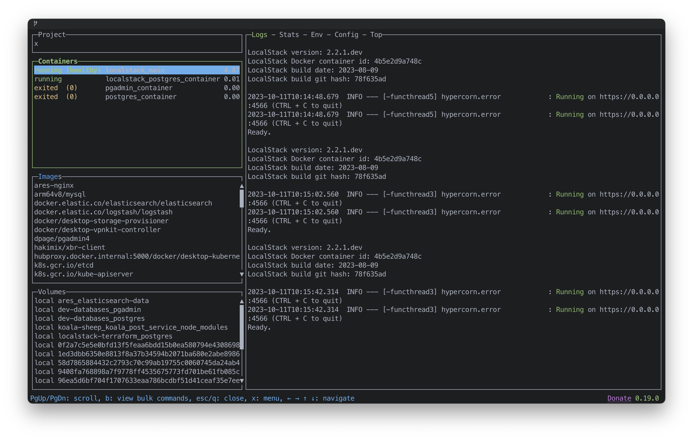
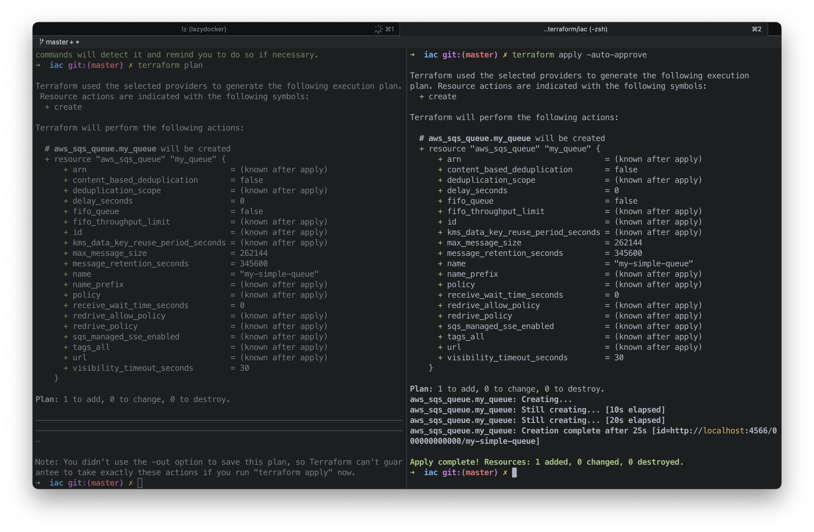

# LocalStack Terraform 

Sample terraform project to deploy AWS resources to localstack. 

- [LocalStack Terraform](#localstack-terraform)
  - [Prerequisites](#prerequisites)
  - [Setup](#setup)
      - [Stopping the containers](#stopping-the-containers)
  - [AWS CLI with LocalStack](#aws-cli-with-localstack)
      - [List queues](#list-queues)
      - [Send messages](#send-messages)
      - [Purge queue](#purge-queue)


## Prerequisites

* [Docker](https://docs.docker.com/install/)
* [Terraform](https://www.terraform.io/downloads.html)
* [AWS CLI](https://docs.aws.amazon.com/cli/latest/userguide/cli-chap-install.html)
* [LocalStack](https://docs.localstack.cloud/getting-started/installation/)

## Setup

The docker-compose file will start LocalStack and a Postgres database.

1. Run `docker-compose up` to start LocalStack and Postgres

```bash
docker compose -f docker-compose.localstack.yml up
```



2. Run `terraform init` to initialize the terraform project

```bash
cd iac
terraform init
```
3. Run `terraform plan` to see the resources that will be created

```bash
terraform plan
```
4. Run `terraform apply` to create the resources

```bash
terraform apply
```



#### Stopping the containers

LocalStack resources will be destroyed. 
```bash
docker compose -f docker-compose.localstack.yml down
```

## AWS CLI with LocalStack
Use the AWS CLI to interact with the resources created in LocalStack.

#### List queues

```bash
aws --endpoint-url=http://localhost:4566 sqs list-queues

```
```json
{
    "QueueUrls": [
        "http://localhost:4566/000000000000/my-simple-queue"
    ]
}
```
#### Send messages

```bash
aws --endpoint-url=http://localhost:4566 sqs send-message --queue-url http://localhost:4566/000000000000/my-simple-queue --message-body "Hello World"
```
```json
{
    "MD5OfMessageBody": "6f5902ac237024bdd0c176cb93063dc4",
    "MessageId": "a1b2c3d4-5678-90ab-cdef-11111EXAMPLE"
}
```
#### Purge queue

```bash
aws --endpoint-url=http://localhost:4566 sqs purge-queue --queue-url http://localhost:4566/000000000000/my-simple-queue
```
```json
{}
```
